# 青春痘內容體系 Phase 1 — 既有內容重新建模與關聯盤點

分析日期：2026-10-06（Asia/Taipei）。對象：本機 pteduimg repository；起始 HEAD：`5d1a8406c5c3d655c68e4e98bc26e5cc5563150d`。

本輪只新增本報告，不修改網站、圖卡、JSON、圖片、索引或部署設定。以下「修正、建立連結、重構」均為待辦建議，尚未實作。網站 URL 依本機頁面與 canonical 核對，沒有把本機存在當作線上部署成功。

## Output 1 — Executive summary

1. **主要分析集合確為 20 張現行圖卡、6 個系列**。其中 17 張屬青春痘照護／用藥／痘痘貼，另 3 張屬酒糟系列；酒糟鑑別頁是青春痘的重要交界，另外兩張維持酒糟延伸定位。
2. **20 張都存在於兩份 cards 資料、兩份 sitemap、seo.json 與 all-cards.html**，核心系列在 cards.json 與 cards.manual.json 的資料一致，皆為 `hidden: false`。沒有待發布核心卡。
3. **19 張有靜態文字版，12 張同時有內容更新日、查核日與來源連結**。7 張雖有文字，但上述三類資訊缺漏；Metronidazole 另 1 張沒有對應文字紀錄與靜態文字版。不能把「19 張有文字」寫成「19 張完成內容查核」。
4. 依本報告整頁可用性與定位分級，20 張為 **🟢 3 張、🟡 15 張、🔵 2 張**。🔵 表示酒糟延伸角色，不是品質通過；A19、A20 仍有明確補強項目。🔴 用於缺少完整現行答案的搜尋意圖，不用來表示已存在但不完善的頁面。
5. **最完整區域是外用藥操作**：A 酸、杜鵑花酸、BPO，以及已具新版文字的抗生素、複方、搭配、刺激處理。前三者圖文大致一致；其餘仍有圖文範圍或視覺表達問題。
6. **最值得保留的既有能力是「立即處理」**：能不能貼、怎麼貼、破掉怎麼辦已各有頁面；應建立有條件的往返，不合併成一條必經閱讀流程。
7. **最大結構問題不是完全沒有連結，而是連結粒度停在系列**。同系列翻頁與「接著可以看」已存在，後者多連向別的系列第一張；例如 A 酸頁沒有在跨系列區直接連到「紅乾刺」答案。
8. **辨識、藥物、保養、破皮與疤痕應構成網路**。搜尋 A 酸、閉鎖粉刺或痘痘貼，都應能直接到適合的下一問；不要求先回首頁讀完青春痘介紹。
9. **就醫是多個頁面共同承擔的出口**：A01／A03 的惡化與留疤、A14 的刺激／過敏、A17 的破口警訊、A18 的鑑別與眼睛警訊，已各有內容。不能假稱已有一張涵蓋全部情況的「就醫總頁」。
10. **最大的內容品質問題是使用者先看到的圖片與較新的文字不完全同義**，以粉刺因果／固定恢復時程、抗生素「不要長期單用」與「不建議單用」的落差最明確。先處理這些問題，再擴大互連與曝光。
11. 重新看圖後，須區分真正敘述落差和視覺風險：A11 圖內已限定 A 酸／BPO 依醫囑隔天開始，A13 也已寫「不是每一層都要等」；問題是日曆、時鐘可能搶過限定文字，不應誤報為整張完全沒有例外說明。
12. **飲食、睡眠、口服藥不是字面上完全未出現**：A01 圖片已提到高油高糖、乳製品、規律作息、口服抗生素與口服 A 酸。它們仍是🔴完整內容缺口，因為只有零星建議，沒有足以承接搜尋意圖的現行解答。這修正前輪只看文字資料可能造成的過度簡化。
13. **最弱區域是女性／荷爾蒙、PCOS、孕備孕完整治痘、口服治療、飲食、營養品及生活誘因**。經期計算器、一般避孕操作、其他疾病的益生菌／Omega-3 提示不能填補這些缺口。
14. **痘印與痘疤不是從零開始**：杜鵑花酸頁已區分深色印與凹疤；既有疤痕辨識頁可承接紅黑印、凸疤、凹疤，適合當共用樞紐，無須在 Phase 1 複製一份青春痘版。
15. 本次只選 **10 個核心集合以外的共用頁 S01–S10**。一般人工皮、清潔／消毒、傷口警訊、疤痕、一般混擦、驗孕與藥師用成分查詢各有明確任務；弱相關的飲食、助眠藥、經期推算等不塞入主網。
16. **3 個退役頁不算現行內容，也不建議復活**。原網址保留退出說明及替代連結，兩份 sitemap、SEO 與全圖卡索引均排除；舊資料中提過口服藥不等於現在有可沿用的口服藥頁。
17. Top 10 都有既有頁面可承接，但「痘痘藥怎麼選」尚無足夠現行內容：A11 只能作已知藥品的安全使用入口，不能包裝成依外觀自行挑藥的樞紐。
18. Phase 2A／2B／2C 是依搜尋意圖明確度、內容缺口與連接能力作的編輯估計，**沒有本輪 Search Console 或關鍵字量數據，不宣稱是真實搜尋量排名**。本輪不製作 Phase 2 文章。

### 1.1 判讀方法與證據範圍

本報告區分三層：**實際檔案事實、內部一致性／定位判斷、建議的決策關係**。圖片已逐張查看本次 20 張的原有 WebP，正文讀取生成 HTML 與 card_content 的 summary／sections；來源檢查確認欄位及頁面可見連結，不表示本輪逐一重讀外部醫療文獻或確認每項主張均受支持。沒有新增治療建議，沒有改寫既有來源查核日期。

| 查核對象 | 本輪核對方式／用途 | 結果 |
|---|---|---|
| cards.json、cards.manual.json | 六組 steps、texts、topics、hidden、favorite_keys、related_series 與完整系列物件比對 | 六組一致；共 20 個不重複圖片／頁面 |
| data/card_content.json | 逐圖配對紀錄與 title、summary、sections、references、updatedAt、sourceCheckedAt、revisionCredit | 核心 19 筆一對一；A19 無配對紀錄 |
| 現有核心 HTML、img/*.webp | title、正文、圖片、可見來源／日期、同系列導覽與跨系列導覽 | 20 頁及 20 圖均讀取；差異見 2.3 |
| sitemap.xml、sitemap-main.xml | 解析 XML loc，而非只找關鍵字 | 兩檔皆含 20 張 canonical URL；不含 3 張退役 URL |
| seo.json、all-cards.html | 精確頁面 key 與連結 | 20 張現行均有；3 張退役均無 |
| public.html | 主題定義與 topics 篩選邏輯 | 有「痘痘／粉刺」；五組青春痘系列含 acne，酒糟系列只含 skin_wound |
| docs/acne-series-maintenance.md | 分組、退出、已補與待補紀錄對照 | 部分待補條目已完成，不可當現行缺口 |
| data/acne_image_text_followup_2026-10-02.md | 舊問題清單與目前圖片重新對照 | 大部分落差仍在；部分屬視覺風險而非相反文字 |
| cards.retired.json、3 個退出 HTML | noindex、替代連結、active steps 與索引排除 | 保持退役，詳 2.5 |
| 共用傷口／疤痕／混擦／驗孕頁及藥品工具 | 正文與適用範圍；必要時參照前輪已讀圖片 | 選 S01–S10，其他不納入主要網路 |

主要證據檔案：[cards.json](C:/Users/liaow/OneDrive/文件/GitHub/pteduimg/cards.json)、[cards.manual.json](C:/Users/liaow/OneDrive/文件/GitHub/pteduimg/cards.manual.json)、[文字資料](C:/Users/liaow/OneDrive/文件/GitHub/pteduimg/data/card_content.json)、[系列維護紀錄](C:/Users/liaow/OneDrive/文件/GitHub/pteduimg/docs/acne-series-maintenance.md)、[圖文待修清單](C:/Users/liaow/OneDrive/文件/GitHub/pteduimg/data/acne_image_text_followup_2026-10-02.md)、[退出紀錄](C:/Users/liaow/OneDrive/文件/GitHub/pteduimg/cards.retired.json)。

### 1.2 分類與狀態字典

分類字母與頁面 ID 分開使用，例如「分類 A」不等於「A01」。每頁只指定一個主分類，次分類可跨分支，避免重複建頁或重複列入 steps。

| 分類 | 名稱 | 現有承接 | 缺口界線 |
|---|---|---|---|
| A | 痘痘種類與辨識 | A01、A02、A18 | 毛囊炎與其他痘樣疹完整鑑別不足 |
| B | 現在怎麼處理 | A15–A17；A02／A03 不擠痘提醒 | 不是所有紅腫或深層痘都能靠貼片解決 |
| C | 痘痘藥物 | A04–A12、A14；A13 跨保養 | 口服治療與個人選藥決策缺口 |
| D | 洗臉與保養 | A03、A13；A02、A07、A11 交叉 | 化妝、卸妝、完整產品選擇不足 |
| E | 飲食 | A01 圖片有零星句子 | 🔴 未有足以承接飲食搜尋的完整現行內容 |
| F | 營養品 | 無青春痘專門內容 | 🔴 鋅、Omega-3、益生菌、維生素 A／D |
| G | 睡眠與生活 | A01 作息、A02／A03 流汗清潔；A06 枕套僅漂白提醒 | 🔴 熬夜、壓力、口罩、安全帽、摩擦、運動、髮品等完整解答 |
| H | 女性／荷爾蒙 | A04 孕備孕提醒、S09 驗孕操作 | 🔴 經前／成人女性／下巴痘、避孕藥治痘、PCOS、spironolactone、孕備孕整體治療 |
| I | 痘印與痘疤 | A05、S06、S07；A01／A03 防留疤提醒 | 🔴 紅黑印與不同凹痘疤的進階處理 |
| J | 何時就醫／轉介 | A01、A03、A14、A17、A18、S04、S06 的現有警訊 | 心理影響及荷爾蒙異常轉介仍不足；沒有完整共同總頁 |

| 狀態 | 定義 | 本報告使用方式 |
|---|---|---|
| 🟢 | 已有且可作核心內容 | 內容與定位大致完整，沒有本輪確認的重大圖文落差；仍可補決策連結 |
| 🟡 | 已有，但需補強 | 圖文、來源／日期、定位或下一步有重要缺項 |
| 🔵 | 共用／延伸資產 | 保留原疾病／工具定位；品質缺項另寫，不重新包裝為治痘主頁 |
| 🔴 | 明顯內容缺口 | 沒有能完整回答該意圖的現行內容；只標位置，不建立新頁 |

### 1.3 目前真的存在的連結，以及缺的連結

下表只記實際 `related_series` 與生成 HTML「接著可以看」。同系列清單和前後箭頭另已存在，不能把它們誤認為新的決策設計。

| 來源系列（成員） | 目前跨系列實際到達頁 | 導覽上的缺口 |
|---|---|---|
| acne（A01–A03） | A04、A11、A15 | 沒有直接到 A18 酒糟鑑別、A14 不適、S06 疤痕 |
| acne_topical_medicines（A04–A07） | A11、A08 | A 酸／杜鵑花酸／BPO／水楊酸讀者的不同下一步被同一組連結取代 |
| acne_antibiotics（A08–A10） | A11、A04 | 沒有在跨系列區直接承接「BPO 是什麼」「重複成分怎麼查」 |
| acne_application（A11–A14） | A04、A08、A15 | 同系列已可翻到 A13／A14，但未以問題明示哪一張處理順序、哪一張處理不適 |
| acne_patch_use（A15–A17） | A01、A11、傷口敷料怎麼選 | 已跨傷口系列，但未精準到清潔／消毒或傷口惡化的答案 |
| rosacea_care（A18–A20） | A01 | 有酒糟→青春痘，缺青春痘辨識→酒糟的對稱決策橋；不代表酒糟是不可發現的孤頁 |

`public.html?topic=acne` 是既有篩選入口，不是具備完整辨識、治療與轉介內容的主文。保留酒糟的 skin_wound 歸屬，透過 A18 作鑑別橋，比把整個酒糟系列當一般青春痘用藥更符合現有內容。

## Output 2 — A01–A20 mapping 表

### 2.1 閱讀規則與共同出口

沿用前輪 A01–A20 識別，避免同一頁換編號。表內 title 為目前 HTML `<title>` 去除所有頁共同的 `｜藥局衛教助手` 後綴；完整 URL 以連結提供。系列使用 cards.json 的精確 key，下方列全名。

**上游、下游、橫向全部是建議的使用者決策關係，不宣稱已存在 href。** 上游是可能在提出前一問後到達此頁的節點，任何一頁也都能由搜尋直接進入。下游以「條件／下一問→答案頁」書寫；🔴項目沒有 URL，不能假裝可點。橫向是同層比較，不代表應併用產品或替換處方。

共同出口 J1–J5 是本報告的分析代碼，不是網站新頁或新錨點。已有警訊在原頁仍應能直接讀到，遇急迫情況不應要求先點另一頁才能知道怎麼求助。

| 出口 | 已有承接與適用情境 | 現況限制 |
|---|---|---|
| J1 病況評估 | A01、A03、A14：深層疼痛、惡化、留疤、療效不足→皮膚科評估 | 沒有涵蓋全情境的總頁 |
| J2 用藥不適 | A14；A06、A08 自有特定警訊：刺激、過敏或特定不良反應→藥師／醫師，急迫症狀依原頁立即求助 | 不把所有不適都當正常適應期 |
| J3 破口／感染 | A17、S04：紅腫擴大、熱痛、流膿、出血等→就醫評估 | 不能只續貼一片，亦不自行診斷感染 |
| J4 鑑別／眼睛 | A18：懷疑酒糟或其他疾病→皮膚科；原頁眼睛急迫警訊→眼科 | 毛囊炎及其他痘樣疹比較仍缺 |
| J5 孕備孕／個別用藥 | A04 已有停用與聯絡醫師提醒；S09 僅處理驗孕時點 | 完整孕備孕痘痘治療、避孕藥治痘、荷爾蒙／PCOS 轉介皆為缺口，不以驗孕結果替代用藥評估 |

### 2.2 20 張核心頁的重新定位

| ID | 現有標題 | URL | 現有所屬系列 | 新知識網主分類 | 次分類 | 使用者搜尋意圖 | 頁面角色 | 上游節點（建議） | 下游節點：下一問→去向（建議） | 橫向節點（建議） | 共同出口 | 現況 | 是否為樞紐 | 是否需補強 | 問題類型 | 建議處置 | Phase 1 優先度 |
|---|---|---|---|---|---|---|---|---|---|---|---|---|---|---|---|---|---|
| A01 | 青春痘嚴重程度外觀 | [頁面](https://liaoweihung.github.io/pteduimg/cards/acne_stage.html) | acne | A 辨識 | 黑白頭、丘疹、膿皰、結節／囊腫；J | 判斷自己看到的外觀與嚴重線索 | 入口／候選樞紐 | 搜尋痘痘種類；A15 不適合貼；A18 回到青春痘辨識 | 粉刺為主怎麼照顧→A02；輕發炎日常→A03；是不是酒糟→A18；已知處方如何用→A11 | S06 顏色或凹凸；A15 可否貼 | J1、J4 | 🟡 | 是 | 是 | 圖片帶治療分級；來源／日期不足；正文僅外觀 | 修正；保留辨識樞紐，不作自行選藥表 | P0 |
| A02 | 粉刺很多怎麼辦？清潔、保養與清粉刺注意事項 | [頁面](https://liaoweihung.github.io/pteduimg/cards/comedo.html) | acne | A 辨識 | B 能否擠；D 清潔；C 粉刺藥 | 黑頭白頭、閉鎖粉刺、能否清粉刺 | 入口／候選樞紐 | 搜尋粉刺；A01；A15 閉鎖粉刺不適合貼 | 日常怎麼洗→A03；已評估外用 A 酸→A04；水楊酸產品疑問→A07；已擠破→A17 | A18 是否其實非粉刺；S06 留印／留疤 | J1 | 🟡 | 是 | 是 | 固定恢復時程、補償性出油因果圖與新版文字不一致 | 修正；保留粉刺入口 | P0 |
| A03 | 輕度發炎型青春痘日常照護怎麼做 | [頁面](https://liaoweihung.github.io/pteduimg/cards/acne_dailycare.html) | acne | D 保養 | B 不擠；C 成分界線；J | 紅腫痘平常怎麼洗、擦、照顧 | 入口／詳細解答 | 搜尋發炎痘保養；A01；A02；A13 回看基礎 | 要排已開立的藥和保養→A13；想貼→A15；已破→A17；越來越多／留疤→A14 的回診線索 | A11 用藥原則；A20 僅確認酒糟後延伸 | J1、J2 | 🟡 | 否 | 是 | 來源／日期不足；圖片將 BPO 等置於保養成分區，藥與保養定位不清 | 修正；保留照護頁，不擴成所有療法總覽 | P1 |
| A04 | 外用 A 酸怎麼擦？治療範圍、刺激處理與孕期提醒 | [頁面](https://liaoweihung.github.io/pteduimg/cards/acne_topicals_02_retinoids.html) | acne_topical_medicines | C 藥物 | 外用 retinoid；D；H 孕備孕 | 拿到 A 酸後怎麼用、脫皮或備孕怎麼辦 | 入口／詳細解答 | 搜尋 tretinoin／adapalene；A02；A10 查複方成分；A11 | 紅乾刺→A14；保濕順序→A13；搭 BPO／酸→A12；不確定是否懷孕→S09 僅作檢測背景並走 J5 | A05、A06、A07 為不同成分解答，非自行換藥 | J2、J5 | 🟢 | 否 | 否（僅補決策連結） | 無本輪確認重大圖文衝突；缺問題導向出口 | 保留 | P1 |
| A05 | 杜鵑花酸怎麼擦？治痘、色素沉澱與刺激處理 | [頁面](https://liaoweihung.github.io/pteduimg/cards/acne_topicals_03_azelaic.html) | acne_topical_medicines | C 藥物 | I 深色痘印；D 刺激管理 | 杜鵑花酸用法、刺癢、痘印能否改善 | 入口／詳細解答 | 搜尋 azelaic acid；S06 深色印；A11 | 是黑印還是凹疤→S06；持續灼熱→A14；和別的藥搭→A12；保養順序→A13 | A04、A07；S07 疤痕產品界線 | J2；孕備孕疑問走 J5 缺口而非自行替代 | 🟢 | 否 | 否（僅補決策連結） | 正文已限定色素印不等於凹洞；下一問尚未直達 | 保留 | P1 |
| A06 | BPO 怎麼用？劑型差異、刺激與漂白注意事項 | [頁面](https://liaoweihung.github.io/pteduimg/cards/acne_topicals_04_bpo.html) | acne_topical_medicines | C 藥物 | 洗去／留敷；抗生素搭配；J | BPO 是什麼、怎麼擦、漂白或過敏怎麼辦 | 入口／詳細解答／安全警示 | 搜尋 BPO；A08／A09；A10；A11 | 和目前處方怎麼搭→A12；複方已有 BPO→A10；紅腫水泡→A14；流程→A13 | A04、A05、A07 | J2 | 🟢 | 否 | 否（僅補決策連結） | 圖文大致一致；枕套內容是漂白，不是生活致痘證據 | 保留 | P1 |
| A07 | 水楊酸怎麼用？粉刺照護與避免重複刷酸 | [頁面](https://liaoweihung.github.io/pteduimg/cards/acne_topicals_08_salicylic.html) | acne_topical_medicines | C 藥物 | D 酸類保養／洗面乳成分 | 粉刺能否用水楊酸、會不會疊酸 | 入口／詳細解答 | 搜尋水楊酸；A02；A13 | 已在用 A 酸／BPO→A12；變紅刺→A14；回到清潔保濕→A03 | A04；A05 | J2 | 🟡 | 否 | 是 | 圖片把保養品概括為刺激；FDA 來源標題主題為 BPO，須查對支撐範圍 | 修正；保留酸類問題入口 | P1 |
| A08 | Clindamycin 痘痘藥怎麼擦？搭配治療與腹瀉警訊 | [頁面](https://liaoweihung.github.io/pteduimg/cards/acne_topicals_05_clindamycin.html) | acne_antibiotics | C 藥物 | 外用抗生素、抗藥性、特定警訊 | 抗生素藥膏如何用、能否單擦或一直擦 | 詳細解答／安全警示 | 搜尋 clindamycin；A10；A11 | 為何處方搭 BPO→A06；兩條如何安排→A12；已是一條複方→A10；持續腹瀉／血便→本頁就醫提醒 | A09；S05 僅比較傷口用途，不互換 | J2（腹瀉警訊保留本頁） | 🟡 | 否 | 是 | 圖片限制「長期單用」，文字限制「單用」；引用含 tretinoin 複方仿單須注意適用範圍 | 修正圖文；不與紅黴素頁合併，保留特定警訊 | P0 |
| A09 | 紅黴素痘痘藥怎麼擦？抗藥性與搭配注意事項 | [頁面](https://liaoweihung.github.io/pteduimg/cards/acne_topicals_06_erythromycin.html) | acne_antibiotics | C 藥物 | 外用抗生素、基劑刺激 | Erythromycin 如何用、為何刺、能否多擦抗生素 | 詳細解答 | 搜尋紅黴素痘痘；A10；A11 | 處方中的 BPO→A06；搭配原則→A12；乾刺怎麼處理→A14 | A08，同類比較不導向自行替換 | J2 | 🟡 | 否 | 是 | 圖片「不建議單獨長期使用」與文字不同義 | 修正；保留成分解答 | P0 |
| A10 | 複方痘痘藥怎麼用？先查成分，避免重複用藥 | [頁面](https://liaoweihung.github.io/pteduimg/cards/acne_topicals_09_combinations.html) | acne_antibiotics | C 藥物 | 複方、重複成分、保存 | 一條藥已有哪些成分、還能不能加別條 | 詳細解答／成分核對入口 | 搜尋複方；A04／A06／A08；A12 | 已含 A 酸／BPO／clindamycin→A04／A06／A08；另外兩條如何搭→A12；商品成分仍不明→S10 藥師工具 | A11 用藥基本；A13 排程 | J2；個別處方請藥師確認 | 🟡 | 否 | 是 | 圖片「A 酸＋Clindamycin」未指明成分；所列仿單與例子需逐項對應 | 修正；保留複方任務，不當全藥物選擇樞紐 | P1 |
| A11 | 痘痘藥怎麼擦？薄擦、逐步適應與保濕防曬 | [頁面](https://liaoweihung.github.io/pteduimg/cards/acne_topicals_01_basics.html) | acne_application | C 藥物 | 薄擦、適應、D 保養、B 破皮 | 已有藥但不知道怎麼開始使用 | 入口／候選樞紐 | 搜尋痘痘藥怎麼擦；A01；A03；A04–A10 | 依成分找用法→A04–A10；有兩種藥→A12；保養順序→A13；不適→A14；破口→A17 | S08 一般外用藥原則 | J2、J3 | 🟡 | 是 | 是 | 日曆可能誤讀成所有藥隔天擦，但圖內已有 A 酸／BPO 限定；不是明確相反正文 | 修正視覺層級；保留安全用藥入口，非自行選藥頁 | P1 |
| A12 | 兩種痘痘藥能一起用嗎？搭配與分時使用原則 | [頁面](https://liaoweihung.github.io/pteduimg/cards/acne_topicals_10_pairing.html) | acne_application | C 藥物 | 成分組合、分時、製劑差異 | 兩條藥能否一起擦、是否要分早晚 | 候選樞紐／詳細解答 | 搜尋 A 酸加 BPO；A04–A10；A11 | 一條已含兩成分→A10；實際早晚怎麼排→A13；愈擦愈刺→A14；一般混擦疑問→S08 | A06、A08、A09 | J2 | 🟡 | 是 | 是 | 同一藥管斜線可能被當複方；同站一般藥膏舊頁原則相衝 | 修正標示；保留搭配樞紐 | P1 |
| A13 | 痘痘藥、保濕與防曬怎麼排？早晚使用示例 | [頁面](https://liaoweihung.github.io/pteduimg/cards/acne_topicals_11_routine.html) | acne_application | D 保養 | C 用藥流程、先後與等待 | 擦藥後能否擦乳液、防曬、要等多久 | 入口／候選樞紐／操作頁 | 搜尋用藥保濕順序；A03–A07；A11／A12 | 乾刺怎麼辦→A14；藥物是否能搭→A12；洗面乳含酸→A07；回查個別 A 酸等待條件→A04 | A03 基本保養；S08 一般混擦界線 | J2 | 🟡 | 是 | 是 | 圖內已有非固定等待說明，時鐘仍可能被誤讀；沒有化妝卸妝完整內容 | 修正視覺；保留藥物＋保養樞紐 | P1 |
| A14 | 擦痘痘藥紅、乾、刺怎麼辦？何時停用或就醫 | [頁面](https://liaoweihung.github.io/pteduimg/cards/acne_topicals_12_irritation.html) | acne_application | J 就醫／轉介 | C 刺激／過敏、B 即時處理 | A 酸脫皮、擦藥紅腫、是不是爆痘期 | 入口／候選樞紐／安全警示 | 搜尋脫皮紅刺；A04–A13 | 輕微刺激下如何安排保濕→A13；破皮→A17；不像單純刺激且反覆泛紅→A18；危急症狀→直接依本頁就醫提醒 | A01 病況惡化；A06／A08 特定警訊 | J1、J2、J3、J4（按情境分流） | 🟡 | 是 | 是 | 標題「減量」較正文的詢問頻率寬；需避免將此頁當所有就醫情況總頁 | 修正標題一致性；保留安全樞紐 | P1 |
| A15 | 痘痘貼適合什麼狀況？ | [頁面](https://liaoweihung.github.io/pteduimg/cards/acne_patch_when_to_use.html) | acne_patch_use | B 現在處理 | 貼片適用性、A 類型辨識 | 這顆有白頭／紅腫／硬硬的能不能貼 | 入口／候選樞紐 | 搜尋痘痘貼；A01／A03；A16 反查適用性 | 適合且需操作→A16；已破滲液→A17；黑頭閉鎖粉刺→A02；深層疼痛→A01 的就醫提醒 | S01 水膠體原理 | J1、J3 | 🟡 | 是 | 是 | 「白頭」與「閉鎖性粉刺」可能造成同詞歧義；來源／日期缺漏 | 修正名詞；保留是否適合的決策入口 | P1 |
| A16 | 痘痘貼怎麼用？ | [頁面](https://liaoweihung.github.io/pteduimg/cards/acne_patch_how_to_use.html) | acne_patch_use | B 現在處理 | 清潔、黏貼、更換 | 已有貼片，不知道如何貼或何時換 | 入口／操作頁 | 搜尋貼法；A15；A17 | 先確認適不適合→A15；已有破口→A17；白色膨起／如何取下→S02；紅腫痛加劇→S04 | S01 一般人工皮但不套用尺寸與時長 | J1、J3 | 🟡 | 否 | 是 | 圖片「變白鼓起就換」比文字／人工皮頁更絕對；來源／日期不足 | 修正產品條件；保留操作頁，不與 A15 合併 | P1 |
| A17 | 痘痘破了怎麼辦？還能擦藥、貼痘痘貼嗎？ | [頁面](https://liaoweihung.github.io/pteduimg/cards/acne_patch_broken_skin.html) | acne_patch_use | B 現在處理 | 清潔止血、避開刺激藥、J 感染 | 擠破／自然破後能否擦藥、貼片 | 入口／候選樞紐／操作／安全警示 | 搜尋破痘；A02／A14／A15／A16 | 用什麼清潔→S03；適合貼且需操作→A16；是不是感染→S04；要不要傷口抗生素→S05；癒合後留下印→S06 | A15 適用性；S01 水膠體 | J3；嚴重出血直接就醫 | 🟡 | 是 | 是 | 內容已有完整情境輪廓；來源／更新／查核日期缺漏 | 補強證據；保留破皮樞紐 | P1 |
| A18 | 青春痘還是酒糟？哪些線索值得就醫確認？ | [頁面](https://liaoweihung.github.io/pteduimg/cards/rosacea_vs_acne_clues.html) | rosacea_care | A 辨識 | 酒糟交界、J 眼睛／皮膚評估 | 臉紅又冒疹，是痘痘還是酒糟 | 入口／候選樞紐／安全警示 | 搜尋酒糟痘痘；A01／A03／A14 | 類似青春痘→A01；已確認酒糟的照護→A20；已開 metronidazole→A19；眼睛警訊→直接依本頁轉介 | A02 粉刺辨識；毛囊炎比較🔴缺口 | J4 | 🟡 | 是 | 是 | 缺來源／日期；青春痘側沒有精準反向連結 | 補強；保留酒糟系列中的鑑別橋，不改成治痘藥頁 | P1 |
| A19 | Metronidazole 怎麼擦？ | [頁面](https://liaoweihung.github.io/pteduimg/cards/acne_topicals_07_metronidazole.html) | rosacea_care | A 辨識延伸 | 酒糟用藥；不是 C 一般治痘藥 | 已拿到 metronidazole，想確認用途及用法 | 詳細解答／延伸 | 搜尋 metronidazole；A18 已有酒糟診斷／處方情境 | 為何不是一般粉刺藥→A18；酒糟如何保養→A20；持續不適→依處方求助 | A20；不列進 A04–A10 的一般治痘選藥比較 | J4、個別用藥諮詢 | 🔵 | 否 | 是 | 無文字紀錄／文字版／來源／日期；檔名與舊系列編號易誤導 | 保留為延伸（已在酒糟系列，不需再次移組） | P1 |
| A20 | 酒糟肌如何清潔、保濕、防曬與減少刺激？ | [頁面](https://liaoweihung.github.io/pteduimg/cards/rosacea_skin_care.html) | rosacea_care | D 保養延伸 | 酒糟清潔、防曬、誘因紀錄 | 酒糟擦保養品刺痛、如何減少刺激 | 操作／延伸 | 搜尋酒糟保養；A18／A19 | 持續泛紅或診斷不明→A18；已有酒糟藥→A19；確屬青春痘照護→A03 | A13 僅比照先依個別藥品安排，非搬用酒糟誘因 | J4、持續不適回診 | 🔵 | 否 | 是 | 來源／日期不足；不能把酒糟飲食／壓力誘因當痘痘證據 | 保留為延伸；補強證據，不擴成青春痘生活頁 | P2 |

| 系列 key | 現有完整系列名稱 | 成員 |
|---|---|---|
| acne | 青春痘與粉刺：先認識，再照護 | A01–A03 |
| acne_topical_medicines | A酸、杜鵑花酸、BPO、水楊酸怎麼用？ | A04–A07 |
| acne_antibiotics | 痘痘抗生素與複方藥膏怎麼用？ | A08–A10 |
| acne_application | 痘痘藥怎麼搭，才不會越擦越刺激？ | A11–A14 |
| acne_patch_use | 痘痘貼與破皮照護 | A15–A17 |
| rosacea_care | 臉紅又冒痘：酒糟與用藥 | A18–A20 |

### 2.3 每頁圖片、文字、來源與日期核對

「來源數」是配對紀錄 references 的筆數，已核對連結出現在 HTML；不是通過醫療查核的來源數。「有」表示靜態文字版存在。「—」表示相應欄位／顯示缺漏，不從 Git、圖片生成日期或檔案 mtime 推測日期。

| ID | 靜態文字 | 來源數／既有名稱摘要 | 內容更新日 | 資料查核日 | 本輪直接看圖與文字的結論 |
|---|---|---|---|---|---|
| A01 | 有 | 0 | — | — | 圖片除四級外觀外還含各級建議治療、口服藥、乳製品與熬夜；文字集中外觀。是範圍落差，不是完整飲食或口服藥內容。 |
| A02 | 有 | 2／AAD 保養、類型治療 | 2026-10-02 | 2026-10-02 | 圖片仍有拔除後固定日程、洗太乾→皮脂增加→更多粉刺，以及毛孔張開因果；文字不承諾這些。明確需先處理。 |
| A03 | 有 | 0 | — | — | 清潔、不擠、保濕防曬大致一致；圖片把 BPO、水楊酸、A 醇並列「保養成分」。需整理產品／藥物定位。SPF 50+ 瓶身插圖不等於正文 SPF 30 以上矛盾。 |
| A04 | 有 | 2／DailyMed tretinoin、NICE | 2026-10-02 | 2026-10-02 | 圖片已限定傳統 tretinoin 洗後等待，已有孕備孕與 A 醇不等同藥用 A 酸提醒；沒有本輪確認的重大衝突。 |
| A05 | 有 | 2／DailyMed AZELEX、AAD 指引更新 | 2026-10-02 | 2026-10-02 | 用途、薄擦、刺激及指定治療區相符；文字進一步區分色素印與凹疤。 |
| A06 | 有 | 2／AAD 治療、FDA hypersensitivity review | 2026-10-02 | 2026-10-02 | 留敷／洗劑、漂白、抗生素搭配及過敏相符；文字多出危急全身症狀，不構成相反指示。 |
| A07 | 有 | 2／AAD 治療、FDA BPO guidance | 2026-10-02 | 2026-10-02 | 圖尾「保養品也算一層刺激」過於概括；文字指含酸／去角質成分。FDA 引用標題主體是 BPO，現階段只能標來源支持範圍待查，不能認定全面支持水楊酸。 |
| A08 | 有 | 2／AAD 指引、DailyMed clindamycin＋tretinoin | 2026-10-02 | 2026-10-02 | 圖片「不適合長期單擦／不建議單獨長期使用」與文字「不建議單用」不同義。引用為複方仿單，後續應逐項確認單方警訊的適用證據。 |
| A09 | 有 | 2／NICE、AAD 治療 | 2026-10-02 | 2026-10-02 | 圖片同樣以「長期」限定單用問題；新版文字沒有該限定。 |
| A10 | 有 | 2／NICE、DailyMed tretinoin＋BPO | 2026-10-02 | 2026-10-02 | 圖片列三組例子，其中「A 酸＋Clindamycin」不夠具體；文字是一般複方原則。應區分不精確例子與已確認錯誤，來源需對應實際例子。 |
| A11 | 有 | 2／NICE、AAD 保養 | 2026-10-02 | 2026-10-02 | 圖片文字已有「A 酸、BPO 可依醫囑」，所以不是所有藥物一律隔天的明文主張；日曆仍有被孤立解讀的風險。 |
| A12 | 有 | 3／AAD 指引、DailyMed tretinoin＋BPO、dapsone | 2026-10-02 | 2026-10-02 | 配對原則大致相符；藥管「Clindamycin／Erythromycin」「A 酸／BPO」斜線容易被誤讀成同一管複方。 |
| A13 | 有 | 2／DailyMed tretinoin、AAD 保養 | 2026-10-02 | 2026-10-02 | 圖片已寫「不是每一層都要等」與依仿單，但大時鐘仍強調 20–30 分鐘。屬視覺層級問題，不是完全沒有條件。 |
| A14 | 有 | 2／NICE、FDA hypersensitivity review | 2026-10-02 | 2026-10-02 | 圖文皆有分級不適與求助；大標「減量」比正文的「與醫療人員討論頻率」寬，需一致化。 |
| A15 | 有 | 0 | — | — | 圖文都把「白頭／膿頭」列適合，又把「閉鎖性粉刺」列效果有限；須釐清白頭詞義，這是頁內語意風險，不是單純圖文不同。 |
| A16 | 有 | 0 | — | — | 圖片「變白、鼓起就更換」；文字有「依產品標示」及「可取下」。與 S02「不必一變白就撕」連結前需說明產品與更換條件，不能直接當同義通則。 |
| A17 | 有 | 0 | — | — | 止血、清潔、破口避藥、單純水膠體、不疊藥與感染警訊相符；主要缺證據與日期。 |
| A18 | 有 | 0 | — | — | 粉刺、中央泛紅、眼睛警訊與共存可能性大致相符；缺來源／日期。白頭示意圖與 A15 用語應一併核對。 |
| A19 | 無 | 0 | — | — | 實際圖片明示治酒糟丘疹膿皰、不是一般粉刺主要治療；頁面缺可讀文字。不能從 acne 檔名推用途。 |
| A20 | 有 | 0 | — | — | 圖文均是酒糟照護，誘因為個人紀錄、不一律忌口；不得拿來填青春痘飲食／壓力缺口。 |

12 張有日期的核心頁同時顯示既有修訂署名「AI 協助資料整理與文字修訂」；這不是醫師審閱認證。本報告不改署名、配對信心或 needsMedicalReview。

### 2.4 精選 10 個共用頁，保留原本定位

S01–S10 是本輪新編的共用頁 ID，不沿用前輪 B／C／D 號碼。🔵是角色分類；「待補」欄獨立記品質限制。每個連結都必須由具體下一問觸發，不在所有青春痘頁一律列出十個連結。

| ID／URL | 現有系列或工具 | 為何值得連／承接的下一問 | 上游→共用頁→回到哪裡 | 品質／沿用限制 | 現況／優先度 |
|---|---|---|---|---|---|
| S01 [人工皮怎麼貼、何時換？](https://liaoweihung.github.io/pteduimg/cards/hydrocolloid_how_to_use.html) | wound_dressings／敷料怎麼選、怎麼換？ | 想知道水膠體吸收變白與一般使用原則 | A15／A16／A17→S01→A15 判斷痘痘是否適合 | 有文字、2 來源與資料日期；一般人工皮的尺寸、留置期不可搬給所有痘痘貼 | 🔵／P2 |
| S02 [人工皮怎麼換？先慢慢取下](https://liaoweihung.github.io/pteduimg/cards/hydrocolloid_change_steps.html) | wound_dressings | 貼片變白、黏住，如何取下與觀察 | A16→S02→A17；惡化→S04 | 有文字、2 來源；內容日 2026-10-03、查核日 2026-10-04。先處理 A16 條件差異再互連 | 🔵／P1 |
| S03 [傷口清潔與消毒，怎麼分？](https://liaoweihung.github.io/pteduimg/cards/wound_4_soln.html) | fall_wound／小傷口怎麼處理？ | 破掉後要用什麼清潔、需要消毒藥水嗎 | A17→S03→A17／A16 | 有文字、1 來源與資料日期；限一般小傷口清潔，不替代感染診斷 | 🔵／P1 |
| S04 [傷口正在變好，還是需要就醫？](https://liaoweihung.github.io/pteduimg/cards/wound_healing_signs.html) | fall_wound | 越紅越痛／滲液是好轉還是惡化 | A17／A16→S04→J3；穩定後回 A17 | 有文字、3 來源與資料日期；可提供趨勢判斷，不能判定每顆膿痘均感染 | 🔵／P1 |
| S05 [傷口一定要擦抗生素嗎？](https://liaoweihung.github.io/pteduimg/cards/wound_oint.html) | fall_wound | 破痘後是否把手邊抗生素藥膏塗上去 | A17→S05→A17；原治痘處方疑問回 A08／A09 | 有文字、1 來源與資料日期；必須區分傷口處理與青春痘療程 | 🔵／P2 |
| S06 [紅黑印、凸疤、凹疤，怎麼分？](https://liaoweihung.github.io/pteduimg/cards/scar_remove_detail.html) | scar_care／傷口好了，如何照顧疤痕？ | 痘痘消了，留下的是顏色還是凹凸 | A05／A17／A01→S06→A05（深色印）、S07（產品用途）；凹凸加重→評估 | 有文字、1 來源與資料日期；紅黑印目前在同一段，進階區分與治療尚缺 | 🔵／P1；候選樞紐 |
| S07 [疤痕產品怎麼用？](https://liaoweihung.github.io/pteduimg/cards/scar_remove.html) | scar_care | 矽膠、保濕、淡斑或凹疤是否同一件事 | S06→S07→S06；非開放傷口才看產品內容 | 有文字、2 來源與資料日期；不宣稱矽膠能填平凹痘疤 | 🔵／P2 |
| S08 [兩種藥膏可以一起擦嗎？混擦、分區與使用順序](https://liaoweihung.github.io/pteduimg/cards/over_one_oint_01.html) | onitment_general／over_one_oint | 一般藥膏混合與按處方分用差在哪 | A11／A12→S08→A12／A13 | 有文字、2 來源及 2026-09-27 雙日期；同系列 02／03／04 尚有固定順序／間隔，擴大引流前先解決相鄰頁不一致 | 🔵／P1（導覽准入條件） |
| S09 [驗孕筆什麼時候驗最準？](https://liaoweihung.github.io/pteduimg/cards/pregnancy_test_timing.html) | pregnancy_test_use／驗孕筆如何用？ | 使用外用 A 酸期間，懷孕不確定時想了解檢測時點 | A04→先依 A04 聯絡醫師；S09 僅補檢測背景→J5 | 有文字，無來源／雙日期；陰性不得被設計成「可以繼續用藥」的通行證，也不能替代口服 A 酸監測要求 | 🔵／P2；有條件納入 |
| S10 [外用藥成分查詢工具](https://liaoweihung.github.io/pteduimg/ingredient-explorer.html) | 獨立藥師工具 | 商品名不等於成分，想核對是否重複 | A10／A12→S10（標明藥師查詢）→對應 A04–A10 | 內嵌成分／產品／適應症資料；不是民眾選藥建議。本機兩份 sitemap 及 all-cards 未收錄此工具，不推論未部署；工具可用性另待發布前確認 | 🔵／P2；有條件納入 |

共用頁的日期完整度不一，例如部分傷口頁資料中有 updatedAt，HTML 未必顯示內容更新列；不可由「JSON 有日期」推論「頁面日期全部可見」。本輪核心 20 頁的可見性已另行逐頁核對，共用頁後續接入仍須確認展示。

| 不納入 Phase 1 主網的候選 | 排除理由 |
|---|---|
| 事前避孕藥吃法／漏服、事後避孕藥、保險套全系列 | 存在操作內容，但尚未有避孕藥治痘的現行主文作上下文；部分頁缺文字、藥型界線。留作 Phase 2 候選，不為湊 H 分支塞進來。 |
| 經期計算器 | 計算週期與受孕期，不能回答經前痘、PCOS 或診斷荷爾蒙問題。 |
| 孕期皮膚癢、伸展紋、孕期睡眠 | 孕期提醒／保濕有重疊，但 A04 與核心保養已能承接有限範圍；不需另繞不同疾病。 |
| 助眠藥、長高習慣、咳嗽飲食、食物過敏、孕期腹瀉、健檢 Omega-3 提示 | 不能拿其他疾病的飲食、營養品或睡眠內容填 E／F／G。 |
| 膿／細菌感染圖卡 pus_s | 的確提毛囊炎，但不是青春痘 vs 毛囊炎比較，且缺文字來源；本輪不把它當已完成的鑑別答案。 |
| 中成藥母方查詢及大量產品紀錄 | 是可留存的研究／專業資料資產，不是完整治痘主文；本輪不擴大到中成藥治療網。 |
| 其他外傷、燙傷、足部、拔牙與口內傷口 | 場景不同，S01–S07 已足以承接真正共用問題。 |

### 2.5 退役頁與文件差異

| 原網址 | 曾處理的意圖 | 目前已存在的替代頁 | 尚未被替代的完整意圖 | 本輪判斷 |
|---|---|---|---|---|
| [acne.html](https://liaoweihung.github.io/pteduimg/cards/acne.html) | 嚴重度、治療與固定月數總覽 | A01、A11 | 個人療程與完整治療選擇不能由舊固定月數承接 | 保留退出頁，不重新收錄 |
| [comedo_dailycare.html](https://liaoweihung.github.io/pteduimg/cards/comedo_dailycare.html) | 粉刺保養與成分 | A03、A07、A04；另有 A02 粉刺入口 | 產品選擇完整比較仍不足 | 保留退出頁，不重複造保養內容 |
| [acne_dailycare_2.html](https://liaoweihung.github.io/pteduimg/cards/acne_dailycare_2.html) | 中度發炎、外用與口服藥期間照護 | A11、A08、A14 | 現行口服抗生素／口服 A 酸完整衛教仍缺 | 不因歷史文字存在而標成現行完整 |

| 舊紀錄／可能誤讀 | 目前可查證狀態 | 採用的判斷 |
|---|---|---|
| 維護紀錄同時把破皮、酒糟鑑別、酒糟保養列「已補充」又列「待補充」 | A17、A18、A20 的 metadata、HTML、圖片、索引都存在 | 是文件殘留，不是三個新頁缺口 |
| 圖文待修清單寫該批文字「尚未提交／推送」 | 本輪這些核心 HTML、圖片、文字資料沒有相對 HEAD 的未提交差異 | 不能沿用舊發布敘述；是否已推送及部署不在本輪驗證範圍 |
| cards.json texts 仍有短標題「粉刺如何處理?」「A 酸類怎麼擦？」等 | 現有 HTML title 與新版文字標題更完整 | Mapping 採目前 HTML title；短標不代表另一頁 |
| 圖內仍有 01／12 至 12／12 | 已拆入四個不同系列，HTML 有原始編號說明與現行組內頁碼 | 是導覽／版本辨識問題，不是缺少圖卡 |
| AGENTS.md 公眾 topic 列表未列 acne | public.html 已定義 acne，五組 metadata 已使用 | 依實際程式與資料承認現有「痘痘／粉刺」篩選；不改規則檔 |
| Metronidazole 檔名含 acne_topicals | 實際圖片、系列及 topics 均屬酒糟延伸 | 不算一般青春痘藥物 |

## Output 3 — 青春痘內容網

### 3.1 圖例與閱讀方式

這是**以現有內容作節點、建議的決策邊作連線**的內容網，不是目前 HTML href 的複製，也不是臨床自行選藥流程。實際現有 href 結構見 1.3。所有 A01–A20 均畫入；S01–S10 為精選共用頁；J 是概念出口而非新增頁。使用者可以從任何有標題的現有節點搜尋進入。

實線表示建議的下一問或跨分支連接，虛線表示缺口／條件式延伸；不是療效因果。紅色節點僅保留缺口位置，不連到虛構 URL。🟢已有可核心使用、🟡需補強、🔵共用／延伸、🔴完整解答缺口。

```mermaid
flowchart TB
  subgraph IDENTIFY["A 痘痘種類與辨識"]
    A01["🟡 A01 外觀與嚴重線索"]
    A02["🟡 A02 粉刺怎麼處理"]
    A18["🟡 A18 青春痘或酒糟"]
    GAP_DIFF["🔴 毛囊炎及其他痘樣疹比較"]
  end

  subgraph NOW["B 現在怎麼處理"]
    A15["🟡 A15 這顆適合貼嗎"]
    A16["🟡 A16 痘痘貼怎麼用"]
    A17["🟡 A17 痘痘破了怎麼辦"]
    S01["🔵 S01 人工皮使用原則"]
    S02["🔵 S02 人工皮更換"]
    S03["🔵 S03 清潔與消毒"]
    S04["🔵 S04 傷口好轉或惡化"]
    S05["🔵 S05 傷口是否需抗生素"]
  end

  subgraph MEDS["C 痘痘藥物：先確認已用成分與處方"]
    A11["🟡 A11 已有藥怎麼開始擦"]
    A04["🟢 A04 外用 A 酸"]
    A05["🟢 A05 杜鵑花酸"]
    A06["🟢 A06 BPO"]
    A07["🟡 A07 水楊酸"]
    A08["🟡 A08 Clindamycin"]
    A09["🟡 A09 Erythromycin"]
    A10["🟡 A10 複方與重複成分"]
    A12["🟡 A12 兩種藥怎麼搭"]
    S08["🔵 S08 一般藥膏混擦原則"]
    S10["🔵 S10 成分查詢：藥師工具"]
    GAP_ORAL["🔴 口服抗生素與 isotretinoin"]
  end

  subgraph CARE["D 洗臉與保養"]
    A03["🟡 A03 發炎痘日常照護"]
    A13["🟡 A13 藥物保濕防曬怎麼排"]
    A20["🔵 A20 酒糟保養與誘因"]
    GAP_CARE["🔴 化妝卸妝及完整產品選擇"]
  end

  subgraph MARKS["I 痘印與痘疤"]
    S06["🔵 S06 紅黑印凸疤凹疤辨識"]
    S07["🔵 S07 疤痕產品用途"]
    GAP_SCAR["🔴 痘印痘疤進階處理"]
  end

  subgraph REFER["J 何時就醫：多頁共同出口，非一張總頁"]
    A14["🟡 A14 紅乾刺與過敏分流"]
    J["🟡 J 概念出口：原頁警訊與專業評估"]
  end

  subgraph HORMONE["H 女性／荷爾蒙"]
    GAP_H["🔴 經前成人女性下巴痘"]
    GAP_OC["🔴 避孕藥治痘及 spironolactone"]
    GAP_PCOS["🔴 PCOS及月經不規則多毛"]
    GAP_PREG["🔴 孕備孕完整治痘用藥"]
    S09["🔵 S09 驗孕時點：僅背景"]
  end

  subgraph LIFE["E F G 生活相關分支"]
    GAP_E["🔴 E 飲食牛奶乳清等完整解答"]
    GAP_F["🔴 F 鋅Omega-3益生菌維生素"]
    GAP_G["🔴 G 睡眠壓力摩擦流汗髮品"]
  end

  A19["🔵 A19 Metronidazole：酒糟用藥"]

  A01 -->|粉刺為主| A02
  A01 -->|日常照護| A03
  A01 -->|想貼片| A15
  A01 -->|已有處方| A11
  A01 -->|反覆泛紅疑慮| A18
  A01 -->|留印或凹凸| S06
  A02 -->|已擠破| A17
  A02 -->|已評估使用成分| A04
  A02 -->|水楊酸疑問| A07
  A02 --> A03
  A18 -->|仍需青春痘辨識| A01
  A18 -->|已確認酒糟照護| A20
  A18 -->|已開立此藥| A19
  A19 --> A20
  A20 -->|持續不適或不確定| A18
  A18 -.-> GAP_DIFF

  A15 -->|適合且需要貼法| A16
  A16 -->|反查是否適合| A15
  A15 -->|已破滲液| A17
  A15 -->|閉鎖粉刺| A02
  A16 --> S02
  A16 --> S01
  A17 --> S03
  A17 --> S04
  A17 --> S05
  A17 -->|適合時看貼法| A16
  A17 -->|癒合後留印| S06
  S01 --> A15
  S02 --> S04
  S03 --> A17
  S05 --> A17

  A11 --> A04
  A11 --> A05
  A11 --> A06
  A11 --> A07
  A11 --> A08
  A11 --> A09
  A11 --> A10
  A11 --> A12
  A11 --> A13
  A11 --> A14
  A04 -->|搭配疑問| A12
  A04 -->|脫皮紅刺| A14
  A05 -->|黑印或凹疤| S06
  A05 -->|刺激| A14
  A06 --> A12
  A07 --> A12
  A08 -->|處方中BPO的用途| A06
  A09 --> A06
  A10 -->|需核對商品成分| S10
  A10 --> A12
  A12 --> A13
  A12 --> S08
  S08 --> A12
  S10 -->|核對後回個別用法| A11

  A03 --> A13
  A03 --> A15
  A13 -->|含酸保養品| A07
  A13 -->|不適| A14
  A14 -->|輕微刺激的保濕問題| A13
  A14 -->|已有破口| A17
  A14 -->|反覆泛紅另需鑑別| A18
  S06 -->|深色印用藥疑問| A05
  S06 --> S07
  S07 --> S06

  A01 --> J
  A14 --> J
  A17 --> J
  A18 --> J
  S04 --> J
  S06 --> J
  A04 -->|孕備孕疑慮先求助| J

  A04 -.->|不確定懷孕的檢測背景| S09
  S09 -.-> GAP_PREG
  A04 -.-> GAP_PREG
  A01 -.-> GAP_H
  GAP_H -.-> GAP_OC
  GAP_H -.-> GAP_PCOS
  GAP_H -.-> GAP_PREG
  GAP_OC -.-> J
  GAP_PCOS -.-> J
  GAP_PREG -.-> J
  A11 -.-> GAP_ORAL
  GAP_ORAL -.-> GAP_PREG
  GAP_ORAL -.-> J
  A03 -.-> GAP_E
  A03 -.-> GAP_G
  A11 -.-> GAP_F
  A13 -.-> GAP_CARE
  S06 -.-> GAP_SCAR
  GAP_SCAR -.-> J

  classDef ready fill:#e6f4ea,stroke:#27813c,color:#14361c;
  classDef improve fill:#fff5cf,stroke:#b78500,color:#493600;
  classDef shared fill:#e5f1ff,stroke:#3979b8,color:#163d62;
  classDef gap fill:#ffe7e7,stroke:#bc4545,color:#642020;
  class A04,A05,A06 ready;
  class A01,A02,A03,A07,A08,A09,A10,A11,A12,A13,A14,A15,A16,A17,A18,J improve;
  class A19,A20,S01,S02,S03,S04,S05,S06,S07,S08,S09,S10 shared;
  class GAP_DIFF,GAP_ORAL,GAP_CARE,GAP_SCAR,GAP_H,GAP_OC,GAP_PCOS,GAP_PREG,GAP_E,GAP_F,GAP_G gap;
```

### 3.2 入口不是閱讀順序：決策路徑示例

| 任意搜尋入口 | 原頁先解決什麼 | 條件式下一步 | 不該做的導流 |
|---|---|---|---|
| 閉鎖性粉刺→A02 | 不把粉刺當洗不乾淨、避免反覆清除 | 已評估藥物→A04；水楊酸疑問→A07；擠破→A17；日常→A03 | 直接送痘痘貼購買／使用頁，或依外觀自配藥 |
| 痘痘貼→A15 或 A16 | 區分適合性與操作 | 有破口→A17；深硬痛→A01／就醫；更換疑問→S02 | 所有痘痘均引導繼續貼；把閉鎖粉刺叫適合貼的白頭 |
| A 酸脫皮→A14 | 不適程度與求助，不用先讀 A 酸百科 | 輕微乾燥的保濕問題→A13；個別藥用法→A04；已裂開→A17 | 先顯示更多酸類搭配、要求硬撐療程 |
| A 酸→A04 | 外用藥個別操作與孕備孕提醒 | 刺激→A14；順序→A13；搭配→A12；孕備孕→先專業評估 | 用驗孕陰性或一般避孕頁替代藥物安全評估 |
| 複方痘痘藥→A10 | 先確認已含什麼，不只看商品名 | 成分仍不明→S10／藥師；搭配→A12；不適→A14 | 直接推薦再加一條 A 酸／BPO |
| 痘痘破掉→A17 | 止血清潔、破口避藥、是否能貼與警訊 | 清潔／消毒→S03；惡化→S04；癒合留印→S06 | 先做除疤產品推薦或例行加抗生素 |
| 痘疤→S06 | 顏色、凹陷、凸起不是同一件事 | 深色印問題→A05；疤痕產品用途→S07；凹凸加重→專業評估 | 以杜鵑花酸或矽膠承諾處理所有疤痕 |
| 月經前爆痘／下巴痘 | 🔴現有內容不能完整承接 | 缺口保留於 H；不假造已存在答案 | 用經期計算器當荷爾蒙痘／PCOS 解答 |
| 牛奶會長痘／熬夜長痘 | A01 僅圖中片段，完整意圖仍🔴 | E／G 缺口；本輪不製作 | 用咳嗽飲食、長高睡眠或酒糟誘因充當答案 |

## Output 4 — Hub Top 10

排名依現有內容能承接的問題數、跨分支能力與安全重要性，不按搜尋量或目前點閱數。下表數量是**列出的不重複既有頁數，不含自身、不含 J 概念出口、不含紅色缺口**；代表整理後可串接，不是目前出鏈統計。所有候選已有網址，Phase 1 不必另建十張樞紐頁。

| 排名／節點 | 現有頁是否承接 | 為什麼應是 hub／角色邊界 | 能串的既有頁（精確數） | 是否需重構 | SEO／使用者導覽價值 | 不整理會留下的斷點 |
|---|---|---|---|---|---|---|
| 1／A01 外觀辨識 | 是，但需先處理分級治療圖示 | 把粉刺、輕發炎、深痛、疑酒糟分向不同問題；不是選藥表 | A02、A03、A11、A15、A18、S06，共 6 頁 | 是：收斂任務與條件式連結 | 承接症狀詞，連向不同任務 | 讀者看到分級就跳到藥物，自行把分類當處方 |
| 2／A11 已有藥怎麼擦 | 是 | 把「我拿到這條藥」導向成分、搭配、保養、刺激；不承擔醫師選藥 | A04–A10、A12、A13、A14、A17、S08，共 12 頁 | 是：依問題分群，不一次堆所有連結 | 承接泛用擦藥查詢，減少跳錯成分 | 所有人只進系列首張 A 酸，找不到自己那條藥 |
| 3／A17 痘痘破掉 | 是 | 連接痘痘、傷口、貼片、感染與癒合後留印 | A15、A16、A14、S03、S04、S05、S06，共 7 頁 | 是：依破口當下狀態整理 | 高明確度的即時問題，可跨用既有傷口內容 | 破口讀者繼續看一般擦藥或先找除疤 |
| 4／S06 痘印／痘疤辨識 | 是，原疤痕系列共用 | 顏色與形狀決定接著問淡印、產品還是評估 | A01、A03、A05、A17、S07，共 5 頁 | 輕度：保留共用頁，補痘後情境入口與出口 | 承接痘印、痘疤混用的搜尋詞 | 杜鵑花酸、矽膠與凹疤被當同一類治療 |
| 5／A13 藥物＋保養 | 是 | 處方與日常保養的交叉點，從任何單藥都能到達 | A03、A04、A06、A07、A10、A11、A12、A14、S08，共 9 頁 | 是：強化條件與視覺層級 | 承接保濕、防曬、順序與等待問題 | 只會查單一成分，無法安排每天實際使用 |
| 6／A14 不適與警訊 | 是，但非全部就醫總頁 | 所有外用藥都可能到的安全節點，分清刺激、過敏、破皮、其他病況 | A01、A04、A05、A06、A07、A08、A13、A17、A18，共 9 頁 | 是：以情境與求助優先，保留危急文字 | 承接紅乾刺、脫皮、爆痘期疑問 | 使用者把不適當有效指標，或一直換產品 |
| 7／A02 粉刺入口 | 是，先修圖片 | 能向清潔、藥物、貼片誤用、破皮與留印分叉 | A01、A03、A04、A07、A15、A17、S06，共 7 頁 | 是：去除固定恢復敘事，保留問題型入口 | 黑頭、白頭、閉鎖粉刺意圖可共用既有解答 | 重複清粉刺而未走到日常控制與安全用藥 |
| 8／A15 貼片適用性 | 是，先釐清白頭詞義 | 「能不能貼」與「怎麼貼」分開，能返回辨識或進破皮處理 | A01、A02、A14、A16、A17、S01，共 6 頁 | 中度：條件式適合／不適合出口 | 痘痘貼搜尋可轉向正確問題，而非只提供貼法 | 深痛與閉鎖粉刺讀者仍反覆貼片 |
| 9／A18 青春痘 vs 酒糟 | 是，保留 rosacea_care | 跨疾病的鑑別橋與眼睛警訊入口，不靠檔名分類 | A01、A02、A03、A14、A19、A20，共 6 頁 | 中度：補反向橋與證據 | 臉紅、刺痛、小疹等模糊搜尋可找到不同路徑 | 只在痘痘藥圈內打轉，酒糟藥也易被誤當治痘藥 |
| 10／A12 兩藥搭配 | 是 | 處理「兩條一起用」與「一條已是複方」的分岔 | A04、A05、A06、A07、A08、A09、A10、A13、A14、S08，共 10 頁 | 中度：清楚區分選項、成分與製劑 | 承接成分組合搜尋，避免重複用藥 | 讀者只能看系列順序，找不到自己手上的組合 |

未入 Top 10 的理由：A03 是重要入口但內容任務較單純，適合連到 A13，不需要再變成所有保養的總頁；A04／A05／A06 保持成分詳細解答，避免每頁都膨脹成總覽。J 是共同出口角色，現階段由多頁承擔，不列成不存在的第十一張頁。

## Output 5 — Phase 1 修整工作清單

以下是分析後的待辦，不是本輪已執行工作。P0 是應先查核／修正的已知內容風險；P1 是改善整體網路的瓶頸；P2 是局部增益；P3 可延後。未驗證的醫療主張列「查核」而非直接宣判錯誤，修圖與改文字應在另一次授權實作中同步處理。

### P0 — 先處理內容與圖文不一致

| 工作 | 影響頁 | 為什麼要做／具體證據 | 完成後改善／驗收方向 |
|---|---|---|---|
| P0-1 粉刺圖文統一 | A02 | 圖片固定拔粉刺恢復時程與補償性出油因果，新版文字已不採用 | 使用者看圖或文字得到相同處理界線；不再把固定恢復日程當保證 |
| P0-2 抗生素單用限制統一 | A08、A09；涉及 A06、A10、A12 的連結語境 | 圖片「長期單用」與文字「單用」不同義 | 圖文限制一致，療程和搭配不被解讀成可自行短期單用 |
| P0-3 辨識入口的治療分級與片段建議查核 | A01 | title／文字是外觀辨識，圖片卻逐級列建議治療、口服藥及泛化飲食句，且無來源／日期 | 釐清辨識與處方界線；保留必要就醫線索，飲食／口服片段不冒充完整答案 |
| P0-4 共用混擦路徑的內部矛盾 | S08 及其現有同系列 over_one_oint_02、03、04；A12、A13 為受影響入口 | S08 新版否定固定通則，但舊頁仍列先水後油、5–10 或 15–30 分鐘、先抗感染再消炎 | 修整前不擴大導流；修整後同站不提供互相抵觸的一般規則。該三舊頁不是新增共用節點 |

### P1 — 修好後能明顯改善整張網

| 工作 | 影響頁 | 為什麼要做 | 完成後改善／驗收方向 |
|---|---|---|---|
| P1-1 逐頁的問題型連結 | A01–A18；Top 10 為首批 | 現有 related_series 只導向首張，不能回答個別下一問 | 依 2.2 建立條件式出口；不是把所有頁互相全連，也不必取消系列翻頁 |
| P1-2 核心來源與日期缺漏 | A01、A03、A15、A16、A17、A18；A19 與 A20 延伸另補 | 7 張有文字但缺三項資訊，1 張連文字都沒有 | 使用實際閱讀來源與真實日期；A19 產生與圖片用途一致的靜態文字；不虛構審閱 |
| P1-3 酒糟的角色與反向導覽 | A01、A14、A18–A20 | 目前跨系列有酒糟→青春痘，青春痘側缺精準鑑別橋 | A18 成為雙向鑑別橋；A19 不加入一般治痘用藥清單，A20 誘因不流入 E／G |
| P1-4 既有來源與主張的對應檢查 | 特別 A07、A08、A10；其餘有來源的核心頁 | 有連結不等於支持全部敘述；BPO guidance 放在水楊酸頁、複方仿單引用需核對範圍 | 每項關鍵主張有對應文件；仍不確定者明確標示待核，不改為假完成 |
| P1-5 藥與保養的定位、非概括刺激 | A03、A07 | BPO 等被列保養成分；「保養品也算刺激」容易包括溫和保濕 | 與 A04–A14 一致區分處方、成分及刺激性保養 |
| P1-6 複方名稱與配對圖示 | A10、A12 | 未指明哪種 A 酸；同管斜線像成分共存 | 「擇一」「固定複方」「分別兩條」可視辨識清楚 |
| P1-7 使用頻率與等待的視覺層級 | A11、A13、A14 | 已有限定正文，但日曆／時鐘／「減量」大標可能先被讀成通則 | 圖上最醒目的提示與正文條件一致；不把這批全數誤報為明確醫療錯誤 |
| P1-8 痘痘貼的名詞與更換條件 | A15、A16、A17、S01、S02 | 白頭與閉鎖粉刺詞義，以及「變白就換」和「不必一變白就撕」未充分區分 | 可辨識膿頭與粉刺；痘痘貼和一般人工皮保留各產品條件 |
| P1-9 整理共同就醫出口的可達性 | A01、A03、A06、A08、A14、A17、A18、S04、S06 | 已有多種警訊，但讀者可能只進單一頁 | 危急提醒原頁即能讀；依 J1–J5 分流，不強迫先去不存在的就醫總頁 |
| P1-10 痘印／痘疤共用橋 | A05、A17、S06、S07 | 已有辨識資產，尚未與青春痘問題網精準銜接 | 從治痘／破皮能到既有辨識，不混淆色素印與凹凸疤 |

### P2 — 有價值，但不是目前瓶頸

| 工作 | 影響頁 | 為什麼要做 | 完成後改善／驗收方向 |
|---|---|---|---|
| P2-1 共用頁的日期展示及條件 | S01–S09 | 部分資料有日期但 HTML 更新列展示不齊；S09 缺來源日期 | 確認資料和可見頁面一致；不讓驗孕取代用藥評估 |
| P2-2 具體問題才顯示專業工具 | S10、A10、A12 | 成分工具是資料，不是選藥建議；目前不在 sitemap | 明確標示藥師用途；驗證工具與目的地後再決定導覽，不自行改工具或 sitemap |
| P2-3 酒糟保養證據與文字完整度 | A20 | 已有實用內容，但缺來源日期，誘因不能移植 | 保留原系列定位，補證據而非擴成所有痘痘生活內容 |
| P2-4 短標題與新版 title 一致性 | 六系列 texts、頁面 title、同系列名稱 | 目前存在短標與新版長標，容易在維護時誤認為不同內容 | 保留 URL 與收藏識別，統一同一頁的辨識名稱 |

### P3 — 可以延後

| 工作 | 影響頁／檔案 | 為什麼可延後 | 完成後改善 |
|---|---|---|---|
| P3-1 舊 01／12 圖片編號 | 12 張 acne_topicals 圖片 | HTML 已有原始編號說明；先解決內容問題 | 視覺編號與現有系列不再衝突；若正在修相關圖片可順帶處理 |
| P3-2 維護文件殘留清理 | 系列維護紀錄、圖文待修清單 | 不影響目前頁面存在與操作 | 刪除已完成的待補條目、區分歷史狀態與現況；本輪未修改 |
| P3-3 不必要的整頁合併與改名 | A01–A20 全部 | 目前任務差異足以維持各 URL，沒有需立即新增退役的證據 | 保留分享、收藏及既有搜尋入口；不因改分類就搬網址 |

## Output 6 — Phase 2 缺口清單

只列名稱，不包含新頁 URL、文章大綱、建置任務或新醫療內容。分期是「搜尋意圖價值的編輯估計 × 現有完整內容缺口 × 串接既有內容能力」的粗分，不是量化搜尋排名；分期也不代表使用者已授權開始製作。

### Phase 2A

- 女性荷爾蒙痘與成人女性痘
- 月經前／生理期痘痘
- 下巴／下顎反覆長痘
- 避孕藥與青春痘
- PCOS：月經不規則、痘痘與多毛
- 懷孕／備孕期間青春痘用藥
- 青春痘與毛囊炎、其他痘樣皮疹辨識
- 痘痘肌化妝、卸妝與產品選擇
- 青春痘治療未改善、反覆留疤與就醫評估

### Phase 2B

- 口服 isotretinoin
- 青春痘口服抗生素
- Spironolactone 與青春痘
- 青春痘與高升糖飲食、甜食
- 青春痘與牛奶、乳製品、乳清蛋白
- 青春痘與睡眠不足、熬夜、壓力
- 紅痘印、黑褐色痘印與凹凸痘疤進階處理
- 青春痘對情緒、自信與生活的影響及求助

### Phase 2C

- 青春痘與鋅補充
- 青春痘與 Omega-3
- 青春痘與益生菌
- 青春痘與維生素 A、維生素 D
- 青春痘與巧克力、油炸食物
- 口罩、安全帽與摩擦相關痘痘
- 流汗、運動與青春痘
- 枕頭套、頭髮與髮品相關痘痘

## Verification

- [x] 沒有修改網站（唯一新增檔為本報告；沒有修改 HTML、JSON、圖片、sitemap、seo.json 或其他網站檔）。
- [x] 沒有新增正式頁面。
- [x] 沒有 commit。
- [x] 沒有 push。
- [x] 沒有部署，沒有執行 build.py。
- [x] 所有 20 張核心頁都有納入，A01–A20 各一列，並逐張查看圖片。
- [x] 沒有把 3 個退役頁算成現行內容，也沒有建議重新收錄。
- [x] 沒有把酒糟藥誤當青春痘藥；A19、A20 保持延伸角色。
- [x] 沒有把弱相關內容硬塞進青春痘系列；核心之外只選 10 個共用頁。
- [x] 每張核心頁至少有上游／下游關係判斷，並明示為建議關係而非已實作連結。
- [x] 缺口、現有片段與完整現行頁有清楚區分。
- [x] Phase 1 沒有越界直接進入大量 Phase 2 製作。
- [x] 使用者任務開始前既有未提交修改／未追蹤檔保持原狀。

### 驗證紀錄與限制

1. 起始對 Git 已追蹤及未被忽略的未追蹤一般檔案建立內容指紋，排除本報告：1,120 個檔案；SHA-256 聚合值 `6f4aa6937bb48f2a047bb1a2471d8b7c0da99f1f441c7d3464dfccaa8265e727`。完成時再次比對，確認集合與內容不變。此比對不涵蓋 Git 內部、忽略的依賴目錄及其他 repository 的隱藏內容。
2. 以只讀程式檢查 20 個 metadata／頁面／圖片配對、SEO key、全圖卡連結、兩份 sitemap 的精確 loc，以及 3 個退出頁的 noindex 和替代連結。
3. 檢查報告包含 6 個 Output、20 列完整 mapping、20 列圖文／來源日期核對、10 個共用頁、10 個候選樞紐與全部驗證項目；本報告內頁面 URL 均能對應本機實際檔案。
4. Mermaid 保留全部核心、共用及缺口節點，檢查節點引用／分類與箭頭；未產生額外圖片或正式 HTML，未作瀏覽器渲染驗證。
5. 本輪是 repository 內容與關聯分析，不是線上部署、搜尋流量或醫療證據重審；沒有把既有引用日期更改為今天，也沒有宣稱所有資料來源仍有效或已逐項核准。

分析於此停止。後續任何圖文修正、連結實作、重建、發布或 Phase 2 製作，均未在本輪執行。
